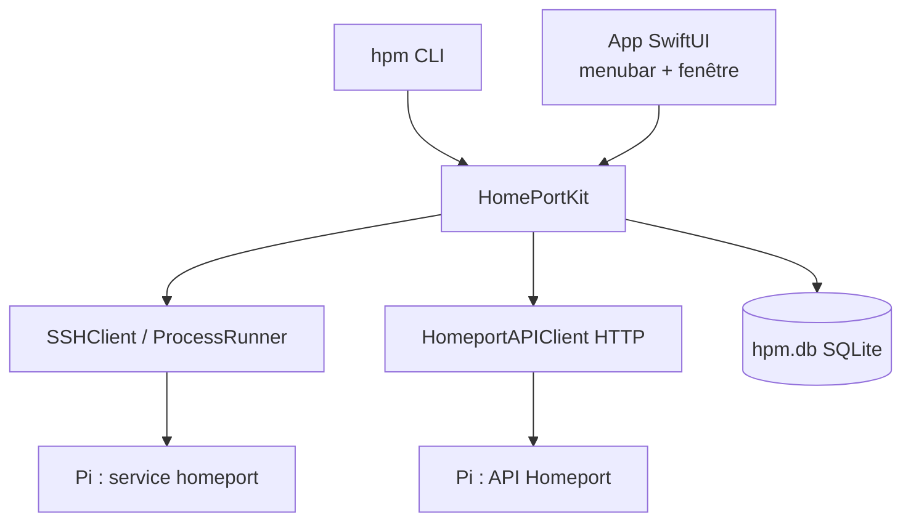
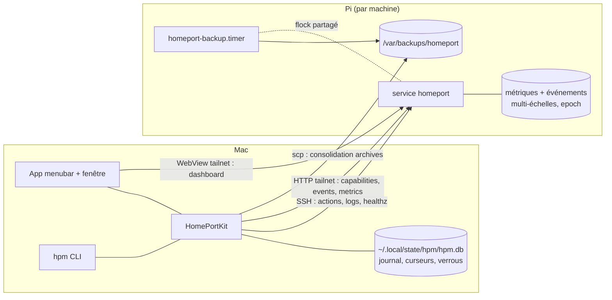

# Architecture Spine — Centre de contrôle unifié

## Design Paradigm

**Bibliothèque cœur en couches + frontends minces.** Toute la logique métier vit dans `HomePortKit` ; les frontends (`hpm` CLI, app SwiftUI) sont des couches de présentation sans logique. Les effets (SSH, process, HTTP, disque) sont isolés derrière des types dédiés de la lib.



Sens des dépendances : les frontends dépendent de la lib, jamais l'inverse ; les frontends ne se connaissent pas ; la lib ne dépend d'aucun frontend.

## Invariants & Rules

### AD-1 — Paradigme lib cœur + frontends minces `[ADOPTED]`

- **Binds:** all
- **Prevents:** de la logique métier dupliquée ou divergente entre CLI et app.
- **Rule:** toute capacité naît dans `HomePortKit` ; un frontend ne contient que présentation, parsing d'arguments et confirmation utilisateur.

### AD-2 — Effets isolés derrière des owners uniques `[ADOPTED]`

- **Binds:** all
- **Prevents:** deux chemins d'accès concurrents à une même ressource externe.
- **Rule:** un seul type possède chaque effet — `SSHClient`/`ProcessRunner` (exécution distante), `FleetStore` (fleet.yaml, y compris l'identité SSH par machine), `ReleaseService` (cache releases GitHub), `HomeportAPIClient` (HTTP API Homeport, nouveau), `HistoryStore` (hpm.db, nouveau). Aucun autre code n'ouvre ces ressources.

### AD-3 — API Homeport en HTTP direct via Tailscale

- **Binds:** CAP-3, CAP-5, CAP-8
- **Prevents:** un transport tunnel SSH incompatible avec la WebView ; trois stories qui résolvent chacune le blocage ATS à leur façon.
- **Rule:** l'API (événements, métriques, capabilities) est servie par le serveur web existant de Homeport et consommée en HTTP clair sur le tailnet. L'app déclare **une seule exception App Transport Security** (Info.plist), partagée par `URLSession` et `WKWebView` — aucune story n'introduit son propre contournement. Le healthz de diagnostic reste vérifié via SSH sur la machine (`curl localhost`). HTTPS via `tailscale cert` : différé (voir Deferred).

### AD-4 — Contrat API inter-repos versionné, un seul rédacteur

- **Binds:** CAP-5, CAP-8 ; repo Homeport
- **Prevents:** un serveur (Homeport) et un client (hpm) construits sur des contrats divergents ; deux story-specs qui rédigent chacun leur moitié de contrat.
- **Rule:** le contrat est un document versionné (semver) dont la source de vérité vit dans le repo Homeport ; HomePortManager en garde une copie épinglée sous `docs/api/` ; `GET …/api/capabilities` renvoie la version du contrat, les features servies et l'**epoch de génération** de l'historique (AD-5) ; hpm déclare la plage de versions qu'il consomme. Le story-spec de la **story 6 rédige seul** la v1 complète (capabilities + events + metrics) ; la story 7 la consomme sans l'étendre.

### AD-5 — Événements en pull avec curseur (epoch, id)

- **Binds:** CAP-5
- **Prevents:** un push sans rattrapage ; une perte silencieuse d'événements après reset/restore de l'historique Pi ; une notification avalée par un fetch concurrent.
- **Rule:** Homeport historise ses événements localement ; le centre interroge `…/events?since=<curseur>` (intervalle 30-60 s). Le curseur est le couple **(epoch, id)** : un reset ou restore côté Pi incrémente l'epoch, le client détecte le changement et repart du début du nouvel epoch. Côté Mac, le curseur de lecture et le marqueur `notified_up_to` sont **deux états distincts** dans hpm.db, et la décision de notifier vit dans **HomePortKit** (pas dans un frontend) : `hpm events` peut avancer la lecture sans jamais faire perdre une notification. Pas de stream en v1 (différé).

### AD-6 — Un propriétaire unique par donnée

- **Binds:** CAP-1, CAP-4..CAP-8
- **Prevents:** deux copies durables d'une même donnée qui divergent.
- **Rule:** métriques et historique d'événements = le Pi (servis par l'API ; le Mac n'en persiste que curseurs et marqueurs) ; journal des tâches = le Mac ; archives de backup = les deux côtés avec les rotations existantes (3 machine / 10 Mac).

### AD-7 — Stockage central Mac : SQLite unique via HomePortKit

- **Binds:** CAP-6, CAP-7 ; curseurs CAP-5
- **Prevents:** des fichiers d'état éparpillés ; des écritures concurrentes CLI/app corrompues ; un schéma sans propriétaire ni migration.
- **Rule:** tout l'état central du Mac (journal des tâches, curseurs, marqueurs, état des jobs, verrous) vit dans `~/.local/state/hpm/hpm.db` (SQLite, WAL, `busy_timeout` obligatoire), écrit exclusivement par `HistoryStore` dans HomePortKit. Le **story-spec 5 définit le schéma initial et le mécanisme de migration** (`PRAGMA user_version`) ; les stories 6 et 8 l'étendent par migration, jamais par table parallèle. Rétention du journal bornée (purge au-delà de 1 an ou 10 000 entrées).

### AD-8 — Métriques multi-échelles côté Pi

- **Binds:** CAP-8 ; repo Homeport
- **Prevents:** un historique non borné ou sans recul long terme.
- **Rule:** Homeport agrège en 4 échelles — 24 h @ 1 min, 7 j @ 5 min, 30 j @ 1 h, 1 an @ 1 j — stockage borné ; l'API sert l'échelle adaptée à la plage demandée.

### AD-9 — Backups planifiés exécutés par le Pi, déployés par hpm

- **Binds:** CAP-7
- **Prevents:** une planification dépendante du Mac allumé ; deux mécanismes de backup concurrents ; un script Pi dépendant du Mac pour résoudre son environnement.
- **Rule:** hpm déploie `homeport-backup.service`/`.timer` (systemd) et le script associé ; le script tourne en root, est **autonome** — il résout le data dir effectif localement (drop-ins systemd), inclut les fichiers root-only (`mqtt.env`), invoque la fonction de backup de Homeport si la version installée l'expose, sinon applique le backup générique hpm — et écrit chaque archive **atomiquement** (tmp + mv, rotation locale 3). Précondition vérifiée par `doctor`/`prereqs` **avant** tout déploiement : sudo NOPASSWD (ou équivalent) sur la machine cible. Un seul pipeline de backup par machine.

### AD-10 — L'état désiré des jobs appartient au Mac

- **Binds:** CAP-7
- **Prevents:** une planification éditée des deux côtés qui diverge.
- **Rule:** la définition des jobs (planning, rétention) se déclare dans la config hpm côté Mac ; `hpm` l'applique de façon idempotente sur le Pi (génération des units + copie de la config, le Pi tourne ensuite en autonomie) ; un écart constaté entre déclaré et installé = warning `doctor`.

### AD-11 — Consolidation opportuniste + explicite, single-flight

- **Binds:** CAP-1, CAP-7
- **Prevents:** deux logiques de rapatriement concurrentes ; le scp d'une archive en cours d'écriture.
- **Rule:** à chaque refresh de flotte, le centre rapatrie les archives **complètes** non encore présentes côté Mac (l'atomicité d'AD-9 garantit qu'une archive visible est finie) en scp, rotation 10, résultat journalisé ; `hpm backup sync` (et son bouton) force la même routine — même code dans HomePortKit, exécution **single-flight par machine** (une consolidation à la fois).

### AD-12 — Une seule mutation à la fois par machine, verrou des deux côtés

- **Binds:** CAP-2, CAP-7, CAP-10
- **Prevents:** deux mutations simultanées sur la même machine — entre vues, entre process Mac (CLI et app), ou entre le Mac et le timer du Pi ; et un verrou orphelin qui rendrait une machine définitivement inadministrable.
- **Rule:** toute action mutante initiée du Mac acquiert un **verrou inter-process persistant** par machine dans hpm.db (pas une file en RAM) et s'enregistre au journal des tâches. Un verrou porte toujours son **détenteur (PID + horodatage de prise)** et est **révocable** : il est considéré périmé dès que son process ne tourne plus, ou passé un TTL de 30 min ; un verrou périmé est repris automatiquement et la tâche correspondante est close en `interrupted` au journal. `hpm unlock <machine>` ne libère qu'un verrou déjà périmé — il refuse tant que le détenteur est vivant, et affiche qui tient le verrou depuis quand. Côté Pi, le script de backup et les actions mutantes hpm partagent un **verrou local** (flock, libéré par l'OS à la mort du process) : le timer saute son tour si une action est en cours, et inversement hpm attend ou refuse proprement. Les lectures restent libres et parallèles.

### AD-13 — CLI d'abord, parité systématique

- **Binds:** all
- **Prevents:** des capacités app-only intestables sans UI.
- **Rule:** chaque capacité s'expose en CLI (`hpm events`, `hpm tasks`, `hpm backup jobs`, `hpm metrics`…) avant ou en même temps que dans l'app ; jamais de capacité accessible uniquement par l'app.

### AD-14 — Le tailnet est l'authentification

- **Binds:** CAP-3, CAP-5, CAP-8
- **Prevents:** deux postures de sécurité incohérentes entre dashboard et API.
- **Rule:** l'API Homeport ne porte pas d'authentification applicative en v1 — l'accès est contrôlé par l'appartenance au tailnet et ses ACL, comme le dashboard aujourd'hui. Aucun secret d'API dans la config hpm.

### AD-15 — FleetModel @MainActor, source unique d'état UI `[ADOPTED]`

- **Binds:** CAP-1..CAP-5, CAP-8, CAP-10
- **Prevents:** des états UI parallèles désynchronisés entre menubar et fenêtre.
- **Rule:** menubar et fenêtre « Centre de contrôle » (NavigationSplitView : sidebar machines, détail en onglets) partagent le même process et le même `FleetModel` `@MainActor` ; les opérations longues tournent hors MainActor via HomePortKit et rapportent leurs résultats au modèle et au journal.

### AD-16 — Les jobs du Pi se racontent en événements, pas au journal Mac

- **Binds:** CAP-5, CAP-6, CAP-7
- **Prevents:** deux écrivains du journal des tâches ; des résultats de jobs invisibles ou doublonnés.
- **Rule:** le journal des tâches (hpm.db) ne consigne que les actions **initiées par le Mac**. Les exécutions du timer Pi produisent des **événements Homeport** (succès/échec de job) remontés par le canal AD-5 ; la vue « jobs » du centre croise la définition (AD-10), les événements reçus et les archives constatées — sans jamais écrire de fausses entrées de tâche.

### AD-17 — Le shell est un canal d'évasion assumé

- **Binds:** CAP-9
- **Prevents:** trois arbitrages divergents (verrou ? journal ? identité ?) autour du terminal.
- **Rule:** une session shell n'acquiert **pas** le verrou AD-12 et n'écrit **pas** au journal — même statut qu'un SSH manuel, c'est l'outil de dernier recours. Elle se connecte obligatoirement avec l'identité SSH de la machine issue de `fleet.yaml` (via FleetStore), comme tous les autres canaux. Son ouverture est journalisée en une entrée informative unique (« session shell ouverte »), sans suivi du contenu.

## Consistency Conventions

| Concern | Convention |
| --- | --- |
| Nommage code | Opérations en extensions `Manager+<Domaine>` ; un type-owner par effet (AD-2) ; identifiants et commits en anglais |
| Identité machine | Le nom d'inventaire `fleet.yaml` est l'id unique partout (journal, curseurs, API, UI) ; l'**identité SSH** (`user@host`) vient de fleet.yaml pour **tous** les canaux — actions, scp, shell (ex. : raspyellow exige `vincent@raspyellow`) |
| Dates & formats | ISO 8601 UTC dans hpm.db et dans l'API ; sérialisation Codable côté Swift ; `Package.resolved` committé fait foi pour les versions de dépendances |
| Événements | `{epoch, id: entier monotone par machine, ts, severity: info\|warning\|critical, type, message}` ; la sévérité est assignée par le **producteur** (Homeport) selon le contrat, qui fixe la liste des types `critical` (v1 : healthz KO, disque presque plein, crash service) |
| Notifications macOS | Une seule politique : machine avec API événements → notifications exclusivement depuis les événements `critical` (AD-5) ; machine sans API → fallback sur les transitions d'état existantes de la menubar. Jamais les deux en même temps pour une machine |
| Actions destructives | `restore`, `remove` et toute action irréversible exigent une confirmation explicite dans **chaque** frontend (NSAlert côté app, prompt côté CLI sauf `--yes`) |
| Erreurs | `HPMError` reste l'enveloppe unique côté kit ; trois états API distincts et affichés distinctement : **disponible**, **non disponible** (404/version hors plage — dégradation propre, jamais une erreur), **injoignable** (erreur réseau — signalé comme tel) |
| Config & état | Config déclarée : `~/.config/hpm/` ; état : `~/.local/state/hpm/` ; cache : `~/.cache/hpm/` (XDG) |
| Sécurité | Pas de secrets dans fleet.yaml ni la config hpm ; accès réseau = tailnet uniquement (AD-14) ; exception ATS unique et documentée (AD-3) |
| Opérations | Livraison : DMG unique signé/notarisé (pipeline `Scripts/release.sh` existant) + binaire `hpm` symlinké ; versions Homeport déployables = tags GitHub uniquement |

## Stack

| Name | Version |
| --- | --- |
| Swift / macOS cible | tools 5.9, macOS 13+ |
| swift-argument-parser | ≥ 1.3 (résolution figée par `Package.resolved` ; 1.8+ exige Swift 6 — ne monter qu'avec la toolchain) |
| Yams | ≥ 5.0 |
| SwiftTerm (nouveau) | **épinglé 1.19.0** (dernière stable 1.x ; la 2.0 exige tools 6.2 — migration différée) ; SSH via `LocalProcessTerminalView` + `/usr/bin/ssh` |
| Swift Charts (graphes) | natif macOS 13+ |
| SQLite | API C système (pas d'ORM tiers) |

## Structural Seed



```text
Sources/HomePortKit/
  HomeportAPIClient.swift    # HTTP API (AD-3, AD-4)
  HistoryStore.swift         # hpm.db : journal, curseurs, verrous (AD-7, AD-12)
  Manager+Events.swift       # pull (epoch, id) + décision de notification (AD-5)
  Manager+Metrics.swift      # lecture métriques (AD-8)
  Manager+ScheduledBackup.swift  # deploy units + sync single-flight (AD-9..AD-11)
App/Sources/
  ControlCenterWindow.swift  # NavigationSplitView (AD-15)
  TerminalTab.swift          # SwiftTerm LocalProcessTerminalView + ssh (AD-17)
docs/api/                    # copie épinglée du contrat API (AD-4)
```

## Capability → Architecture Map

| Capability | Lives in | Governed by |
| --- | --- | --- |
| CAP-1 tableau de bord | FleetModel + fenêtre | AD-1, AD-15 |
| CAP-2 actions machine | Manager+* via verrou | AD-1, AD-12, AD-13, convention destructives |
| CAP-3 dashboard intégré | WebView (fenêtre) | AD-3, AD-14 |
| CAP-4 logs centralisés | Manager+Service (SSH) | AD-2, AD-13, convention identité SSH |
| CAP-5 événements | HomeportAPIClient + Kit | AD-3..AD-6, AD-16, conventions événements/notifications |
| CAP-6 journal des tâches | HistoryStore | AD-7, AD-12, AD-16 |
| CAP-7 backups planifiés | Manager+ScheduledBackup | AD-9..AD-12, AD-16 |
| CAP-8 métriques | HomeportAPIClient + Swift Charts | AD-3, AD-4, AD-8 |
| CAP-9 shell | TerminalTab (SwiftTerm) | AD-17, convention identité SSH |
| CAP-10 updates | ReleaseService + Manager+Install | AD-2, AD-12, conventions (tags only) |

## Deferred

- **Console web** — étape ultérieure explicite du spec ; reprendre quand le natif est livré.
- **Auth applicative (token)** — reprendre si la flotte s'ouvre hors tailnet personnel ou à l'arrivée de la console web (AD-14 la prépare : un seul point d'accès HTTP à durcir).
- **HTTPS sur le tailnet (`tailscale cert`)** — reprendre avec le durcissement token ou la console web ; en v1 l'exception ATS unique (AD-3) suffit pour une app Developer ID hors App Store.
- **Stream d'événements (SSE/WebSocket)** — optimisation de réactivité ; le pull à curseur (AD-5) reste le mécanisme de vérité.
- **SwiftTerm 2.0** — migration quand le projet passera à Swift tools 6.2.
- **Sparkle auto-update de l'app** — candidat backlog, hors spec.
- **Schéma détaillé des tables hpm.db** — story-spec 5 (owner du schéma + migrations, AD-7) ; **contrat API v1 détaillé** — story-spec 6 (rédacteur unique, AD-4).
- **Détail visuel des onglets** — libre au niveau story tant que AD-15 et les conventions tiennent.
- **Renommage d'une machine d'inventaire** — non supporté en v1 (l'id fleet.yaml est réputé stable) ; à traiter si le besoin apparaît.
