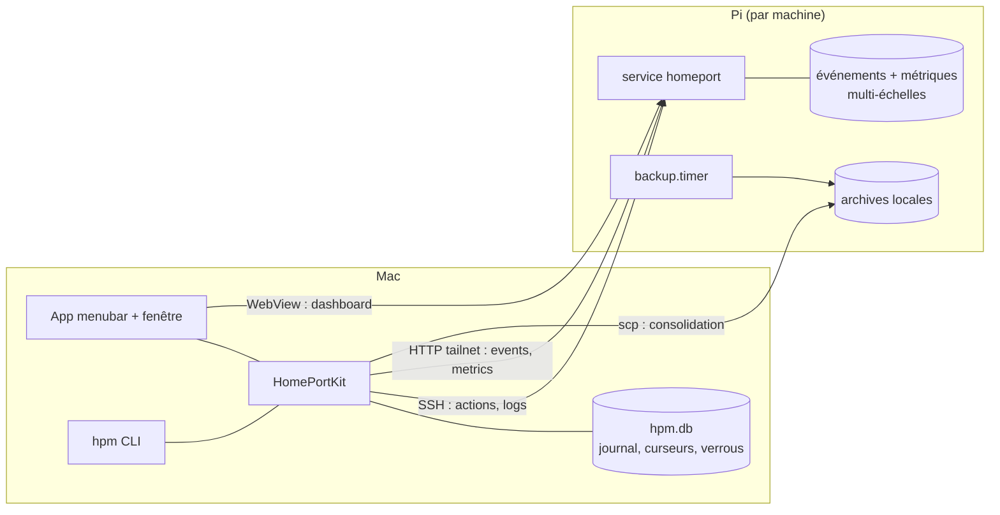

# Solution Design — Centre de contrôle unifié de la flotte Homeport

> Version narrative de l'architecture, pour lecture humaine. Le contrat de build qui fait foi est
> [`ARCHITECTURE-SPINE.md`](ARCHITECTURE-SPINE.md) (17 décisions AD-1..AD-17) ; le raisonnement
> complet derrière chaque décision vit dans le memlog de ce dossier. Ce document raconte — il ne
> gouverne pas.

## 1. Le projet en une phrase

Faire de HomePortManager un centre de contrôle unifié : une seule fenêtre pour voir l'état
de toute la flotte Homeport, passer de machine en machine, lire logs et événements, suivre des
graphes de métriques, piloter backups planifiés et mises à jour — sans jamais ouvrir un terminal SSH
à la main.

## 2. Ce qui existe déjà et qu'on garde

La v1.0.0 a posé un socle sain que l'architecture **ratifie** plutôt que de le remplacer :

- **HomePortKit**, bibliothèque Swift qui contient toute la logique (SSH, backups, updates, config,
  doctor), avec deux frontends minces : le CLI `hpm` et l'app barre de menus SwiftUI.
- Le modèle **agentless** : le Mac pilote tout en SSH pur ; les Pi n'ont besoin ni d'agent ni d'accès
  GitHub.
- Les conventions opérationnelles : inventaire `fleet.yaml` sans secrets, versions Homeport taguées
  uniquement, DMG signé/notarisé, rotations de backups 3 (machine) / 10 (Mac).

La nouveauté structurante de cette itération : le Pi devient **producteur de données** (événements,
métriques) servies par une API HTTP que Homeport lui-même expose — c'est le seul endroit où le
projet frère est mis à contribution, via un contrat versionné rédigé une seule fois (story 6).

## 3. La forme : une seule app, une fenêtre de plus

Pas de seconde app, pas de console web (pour l'instant) : l'app barre de menus existante gagne une
fenêtre « Centre de contrôle » en `NavigationSplitView` — sidebar des machines à gauche, détail à
droite en onglets (Résumé, Logs, Événements, Métriques, Backups, Shell, Updates). Menubar et fenêtre
partagent le même process et le même `FleetModel`, donc le même état, toujours cohérent.

Le CLI reste premier : chaque capacité naît dans HomePortKit et s'expose en `hpm events`,
`hpm tasks`, `hpm backup jobs`, `hpm metrics`… avant ou en même temps que dans l'app. C'est la
philosophie du projet depuis le premier jour, et c'est ce qui rend chaque story testable sans UI.

## 4. Les flux de données

Trois canaux, trois usages :

- **SSH** (existant) pour agir : update, restart, backup à la demande, logs, healthz de diagnostic.
- **HTTP sur le tailnet** (nouveau) pour observer : le Mac tire les événements et les métriques que
  Homeport historise localement. Le réseau Tailscale fait office d'authentification, comme pour le
  dashboard aujourd'hui ; l'app porte une exception App Transport Security unique et documentée.
- **scp** pour consolider : les archives de backup produites sur le Pi sont rapatriées au fil des
  refreshs.

### Pourquoi le pull et pas le push ?

Le Mac dort, s'éteint, part en déplacement. Un flux poussé perdrait tout pendant ces absences. À la
place, Homeport garde l'historique et le Mac **tire avec un curseur** `(epoch, id)` : au réveil, il
rattrape tout ce qu'il a manqué ; si l'historique du Pi a été réinitialisé (restore), l'epoch change
et le client repart proprement. L'intervalle de 30-60 s suffit largement pour une flotte domestique.

### Qui possède quoi ?

Une donnée = un propriétaire, pas de copie qui diverge :

| Donnée | Propriétaire | Le l'autre côté voit… |
| --- | --- | --- |
| Métriques, historique d'événements | le Pi (servis par l'API) | des lectures, plus un curseur |
| Journal des tâches | le Mac (`hpm.db`) | rien — les jobs Pi remontent en événements |
| Archives de backup | les deux (rotations 3 / 10) | la consolidation rapproche |
| Définition des jobs planifiés | le Mac (config hpm) | une copie appliquée, drift détecté par doctor |

## 5. Les backups planifiés : le Pi travaille, le Mac orchestre

Le reproche fait au modèle v1 : pas de backup si le Mac dort. La réponse : hpm **déploie** sur chaque
Pi une unit systemd (`homeport-backup.timer`) et un script autonome — il tourne en root, résout
lui-même le data dir effectif, embarque les fichiers root-only, écrit ses archives atomiquement, et
applique la rotation locale. La *définition* des jobs (planning, rétention) reste déclarée côté Mac
et appliquée de façon idempotente ; le Pi exécute ensuite en toute autonomie, Mac éteint.

Chaque exécution du timer produit un **événement** (succès/échec) que le centre récupère par le canal
standard — le journal des tâches du Mac, lui, ne consigne que ce que le Mac a initié. Et pour que
timer et actions hpm ne se marchent jamais dessus, les deux côtés se verrouillent : flock partagé sur
le Pi, verrou persistant par machine dans `hpm.db` côté Mac (valable entre le CLI et l'app, qui sont
deux process distincts).

Un verrou persistant survit à un crash — il doit donc savoir mourir. Chacun porte son détenteur (PID
et horodatage de prise) et devient reprenable dès que ce process ne tourne plus, ou passé trente
minutes ; la tâche restée en l'air se clôt alors en `interrupted`. `hpm unlock` existe pour le cas
résiduel, et refuse tant que le détenteur respire : une machine ne devient jamais inadministrable,
et personne ne casse une opération en cours.

## 6. Les choix techniques nouveaux, et pourquoi

| Choix | Raison |
| --- | --- |
| SQLite (API C, sans ORM) pour `hpm.db` | un seul fichier d'état requêtable, WAL pour la concurrence CLI+app, zéro dépendance nouvelle — la philosophie du projet |
| Métriques multi-échelles (24 h@1 min → 1 an@1 j) | un an de recul avec un stockage borné à quelques Mo côté Pi |
| SwiftTerm **1.19.0** épinglé pour le shell | vrai terminal embarqué dans la fenêtre ; la 2.0 exige Swift tools 6.2, on migrera avec la toolchain |
| Swift Charts natif | déjà dans la cible macOS 13+, aucun ajout |
| Exception ATS plutôt que HTTPS `tailscale cert` | app Developer ID hors App Store, tailnet privé ; le durcissement (HTTPS, token) est différé avec une condition de reprise claire |

Le shell mérite un mot : c'est un **canal d'évasion assumé**. Une session terminal ne prend pas le
verrou d'action et n'est pas journalisée en détail (une simple entrée « session ouverte ») — même
statut qu'un SSH manuel. Elle utilise en revanche obligatoirement l'identité SSH de l'inventaire,
comme tous les canaux (raspyellow exige `vincent@raspyellow`, et c'est l'inventaire qui le sait).

## 7. La dégradation, partout

Le centre doit rester utilisable face à un Homeport qui n'a pas encore l'API (ou plus de réseau).
Trois états, trois affichages distincts : **disponible**, **non disponible** (version sans API —
les onglets concernés l'affichent posément, rien ne casse), **injoignable** (erreur réseau, signalée
comme telle). Même logique pour le backup planifié : si la version de Homeport installée expose sa
propre fonction de backup, le script l'utilise ; sinon il applique le backup générique hpm.

Les notifications suivent la même bascule : machine avec API → seules les alertes `critical`
(healthz KO, disque presque plein, crash service — la liste vit dans le contrat) notifient ; machine
sans API → les notifications de transition existantes de la menubar continuent de servir. Jamais les
deux à la fois, donc jamais de doublon.

## 8. Ce qu'on a explicitement décidé de ne pas faire (encore)

- **Console web** — l'étape d'après, une fois le natif livré ; AD-14 et AD-3 lui préparent le terrain
  (un seul point d'accès HTTP à durcir).
- **Token applicatif / HTTPS tailnet** — quand la flotte sortira du tailnet personnel, ou avec la
  console web.
- **Stream d'événements (SSE/WebSocket)** — le pull suffit ; ce serait une optimisation de confort.
- **SwiftTerm 2.0, swift-argument-parser 1.8+** — liés à la montée de toolchain Swift 6.
- **Sparkle** — backlog, hors spec.
- Et les non-goals du spec : HA, migration, RBAC, firewall, gestion du stockage, virtualisation,
  supervision de services tiers.

## 9. Comment les 9 stories s'appuient dessus

Le backlog dérivé (`docs/specs/epics.md`) découpe ces invariants en 3 epics et 12 stories :

| Story | Ce que le spine lui fixe |
| --- | --- |
| 1.1 — Fenêtre + tableau de bord | AD-15 (un process, un FleetModel), AD-1 |
| 1.2 — Journal + socle hpm.db | AD-7 (owner du schéma + migrations), AD-12 (table de verrous) |
| 1.3 — Actions machine | AD-12 (verrou révocable), confirmations destructives |
| 1.4 — Dashboard intégré | AD-3 (exception ATS unique), AD-14 |
| 1.5 — Logs | identité SSH depuis fleet.yaml, AD-13 |
| 2.1 — Contrat API + événements | AD-4 (rédacteur unique du contrat v1), AD-5 (epoch, id) |
| 2.2 — Notifications + dégradation | AD-5 (notified_up_to), politique unifiée de notification |
| 2.3 — Métriques | AD-8 (échelles), consomme le contrat sans l'étendre |
| 3.1 — Déploiement des jobs | AD-9, AD-10 (script autonome, atomicité, précondition sudo), AD-16 |
| 3.2 — Consolidation + vue | AD-11 (single-flight), AD-16 |
| 3.3 — Mises à jour | AD-2, AD-12, versions taguées uniquement |
| 3.4 — Shell | AD-17 (canal assumé), SwiftTerm 1.19.0 épinglé |

---

*2026-08-23 — dérivé du memlog d'architecture et validé par la passe de revue à 4 relecteurs
(rubric, vérification web, adversarial, réconciliation spec) ; rapports dans [`reviews/`](reviews/).
Mis à jour après la revue du backlog, qui a fait apparaître le cas du verrou orphelin (AD-12).*
